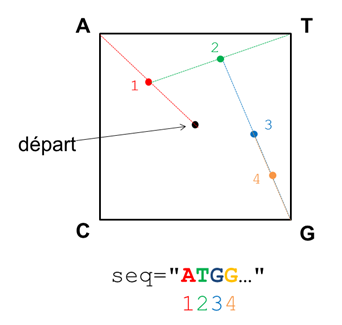

Bienvenue au cours de Python du DU Bii. Vous trouverez sur ce dépôt toutes les informations et ressources nécessaires.

---
## Intervenants

1. Sandra Dérozier, INRAE, `<sandra.derozier@inrae.fr>` (co-responsable)
2. Pierre Poulain, Université de Paris, `<pierre.poulain@u-paris.fr>` (co-responsable)
3. Hubert Santuz, CNRS, `<hubert.santuz@ibpc.fr>`
4. Magali Hennion, CNRS, `<hennion@bio.ens.psl.eu>`
5. Benoist Laurent, IBPC, `<benoist@ibpc.fr>`
6. Julie Lao, INRAE, `<julie.lao@inrae.fr>` 


## Activités préparatoires

Un certain nombre de prérequis sont à préparer avant le premier cours. Ils sont indiqués sur la [page dédiée](https://du-bii.github.io/accueil/activites_preparatoires/).

## Synopsis

Dans ce cours, nous allons voir les bases du langage Python. Au-delà de l'apprentissage de la syntaxe du langage Python, nous allons voir progressivement quelques bases d'algorithmie, c'est-à-dire comment transformer un problème énoncé en français, en une suite d'instructions informatiques.

L'apprentissage de la programmation est un processus nécessitant un certain investissement. Ainsi, nous vous conseillons de faire un maximum d'exercices sur une base régulière afin d'acquérir certains automatismes. 

À la fin du cours, vous devriez être capable d'écrire des scripts et des *notebooks* Jupyter pour :

- Lire des fichiers contenant des données biologiques et rechercher des contenus spécifiques dans ces fichiers.
- Changer le format des données d'un fichier en un autre.
- Faire des calculs de base sur les données extraites des fichiers.
- Réaliser une suite de tâches plus ou moins complexes.
- Avoir les bases pour continuer à vous former par vous même après la fin du DU.

En outre, vous apprendrez également à utiliser des modules incontournables en analyse de données (pandas, numpy, matplolib) en bioinformatique.

## Organisation des cours

Les enseignements seront donnés sous forme de cours / TP, quelques minutes de théorie en *live coding* seront suivies d'une mise en pratique immédiate. 

À titre indicatif, nous détaillons dans la suite le découpage des différentes séances. Ce découpage est succeptible de changer en fonction du degré d'avancement de l'ensemble des stagiaires. N'hésitez pas à revenir régulièrement sur cette page pendant la formation.

Le cours est intégralement disponible [en ligne](https://python.sdv.univ-paris-diderot.fr/). Les corrections des exercices se trouvent sur la [page Moodle du cours](https://moodlesupd.script.univ-paris-diderot.fr/mod/folder/view.php?id=171492).


### Séance 1 -- mardi 2 mars : 9h30 - 12h30

Instructeurs : Sandra Dérozier & Pierre Poulain  
Helpers : Hubert Santuz, Magali Hennion, Benoist Laurent & Julie Lao

Programme : révisions des notions travaillées en autonomie. 
[Variables](https://python.sdv.univ-paris-diderot.fr/02_variables/), 
[affichage](https://python.sdv.univ-paris-diderot.fr/03_affichage/), 
[listes](https://python.sdv.univ-paris-diderot.fr/04_listes/), 
[boucles et comparaisons](https://python.sdv.univ-paris-diderot.fr/05_boucles_comparaisons/).

<!--

**Corrections des exercices**

Les corrections des exercices se trouvent sur [Moodle](https://moodlesupd.script.univ-paris-diderot.fr/mod/folder/view.php?id=171492).

**Liens vers des articles intéressants**

* Lien vers une [interview de Guido van RossumURL](https://lemonde.fr/pixels/article/2018/07/25/je-n-imaginais-pas-que-python-connaitrait-un-tel-succes_5335917_4408996.html)
* Un article intéressant qui montre l'importance de la programmation en biologie et qui évoque Python bien sûr ! [Ten simple rules for biologists learning to programURL](https://journals.plos.org/ploscompbiol/article?id=10.1371/journal.pcbi.1005871)

**Un peu de travail pour la prochaine séance**

* lire le chapitre **[3.2. Ecriture formatée](https://python.sdv.univ-paris-diderot.fr/03_affichage/#32-ecriture-formatee)**
* faire les exercices sur l'**écriture formatée** ([3.5.1 à 3.5.5](https://python.sdv.univ-paris-diderot.fr/03_affichage/#35-exercices))
* faire les exercices sur les **boucles** ([5.4.1 à 5.4.9](https://python.sdv.univ-paris-diderot.fr/05_boucles_comparaisons/#54-exercices))

-->

### Séance 2 -- mercredi 3 mars : 14h30 - 17h30

Instructeurs : Sandra Dérozier & Pierre Poulain  
Helpers : Hubert Santuz, Magali Hennion, Benoist Laurent & Julie Lao

Programme : 
[boucles et comparaisons](https://python.sdv.univ-paris-diderot.fr/05_boucles_comparaisons/), 
[tests](https://python.sdv.univ-paris-diderot.fr/06_tests/), 
[fichiers](https://python.sdv.univ-paris-diderot.fr/07_fichiers/).

<!--

**Un peu de travail pour la prochaine séance**

* lire le chapitre **[7. Fichiers](https://python.sdv.univ-paris-diderot.fr/07_fichiers/)**
* lire le chapitre **[8. Modules](https://python.sdv.univ-paris-diderot.fr/08_modules/)**
* faire les exercices sur les **boucles** ([5.4.10](https://python.sdv.univ-paris-diderot.fr/05_boucles_comparaisons/#5410-pyramide) et [5.4.11](https://python.sdv.univ-paris-diderot.fr/05_boucles_comparaisons/#5411-parcours-de-matrice))
* faire un exercice sur les **tests** ([6.7.9 méthode 1](https://python.sdv.univ-paris-diderot.fr/06_tests/#methode-1-peu-optimale-mais-assez-intuitive))
* faire les exercices sur les **fichiers** ([7.7.1](https://python.sdv.univ-paris-diderot.fr/07_fichiers/#771-moyenne-des-notes), [7.7.2](https://python.sdv.univ-paris-diderot.fr/07_fichiers/#772-admis-ou-recale) et [7.7.3](https://python.sdv.univ-paris-diderot.fr/07_fichiers/#773-spirale-exercice))

-->

### Séance 3 -- jeudi 11 mars : 13h30 - 16h30

Instructeurs : Sandra Dérozier & Pierre Poulain  
Helpers : Hubert Santuz, Magali Hennion, Benoist Laurent & Julie Lao

Programme :
[notebook Jupyter](https://python.sdv.univ-paris-diderot.fr/18_jupyter/) (et [aussi](https://cupnet.net/intro-jupyter-dubii/)), 
[modules](https://python.sdv.univ-paris-diderot.fr/08_modules/), 
[matplotlib](https://python.sdv.univ-paris-diderot.fr/17_modules_interet_bioinfo/#173-module-matplotlib).

<!--

**Un peu de travail pour la prochaine séance**

- Refaire le [TP sur Jupyter](https://cupnet.net/intro-jupyter-dubii/)
- [Exo 5.4.12](https://python.sdv.univ-paris-diderot.fr/05_boucles_comparaisons/#5412-parcours-de-demi-matrice-sans-la-diagonale-exercice) Parcours de demi-matrice sans la diagonale
- [Exo 6.7.9 (méthode 2)](https://python.sdv.univ-paris-diderot.fr/06_tests/#methode-2-plus-optimale-et-plus-rapide-mais-un-peu-plus-compliquee) Détermination des nombres premiers inférieurs à 100
- [Exo 8.7.9](https://python.sdv.univ-paris-diderot.fr/08_modules/#879-determination-du-nombre-pi-par-la-methode-monte-carlo-exercice) Détermination du nombre pi par la méthode Monte-Carlo ; si vous vous sentez capable, vous pouvez essayer de faire l'exercice dans un notebook jupyter et de faire un plot inspiré de la [page Wikipedia sur le Monte-Carlo](https://upload.wikimedia.org/wikipedia/commons/thumb/8/84/Pi_30K.gif/440px-Pi_30K.gif) : les points dans le cercle en rouge, les points or du cercle en bleu. Vous pouvez utiliser pour cela la fonction `plt.scatter(x, y)`. Cette fonction dessine un nuage de points dans un graphe, par exemple :

```
import matplotlib.pyplot as plt

x = [1, 3, 4, 4, 7, 8, 2, 5, 7, 2]
y = [8, 9, 1, 2, 9, 4, 2, 2, 2, 8]

plt.scatter(x,y)
plt.show() # inutile dans un notebook, obligatoire dans un script lancé dans un shell
```

- Lire les chapitres [10 Plus sur les chaînes de caractères](https://python.sdv.univ-paris-diderot.fr/10_plus_sur_les_chaines_de_caracteres/) et [11 Plus sur les listes](https://python.sdv.univ-paris-diderot.fr/11_plus_sur_les_listes/)
- Faire le [QCM d'entraînement](https://moodlesupd.script.univ-paris-diderot.fr/mod/quiz/view.php?id=225633)

### Exercices pour ne pas perdre la main pendant le confinement

#### Correction du Monte-Carlo pour la détermination du nombre pi

Le notebook corrigeant l'exo 8.7.9 est [ici pour le regarder](https://github.com/DU-Bii/module-2-Python/blob/master/data/pi_MC.ipynb), pour le télécharger c'est [ici](data/pi_MC.ipynb).

#### Exo du 3 avril 2020

Télécharger la séquence du [génome du SARS-COV2 au format fasta](https://www.ncbi.nlm.nih.gov/nuccore/MN908947.3?report=fasta). Dans le même répertoire, créer un script nommé `compo_sars_cov2.py` qui calcule la composition en ATGC de ce génome. Voici les différentes étapes proposées :
- Ouvrir le fichier en lecture avec `with` et récupérer la séquence dans une chaine de caractères `seq` ;
- Attention à ne pas récupérer la première ligne qui commence par le caractère `>` (tiens n'y avait-il pas une méthode pour ça dans le chapitre 10 ;-) ???) ;
- Attention à chaque ligne il vous faudra enlever le retour à la ligne (*hint* la méthode `.strip()` est votre amie, cf. chapitre 10 ;-) !) ;
- Une fois la séquence récupérée, faire une boucle sur tout le génome et calculer le nombre de ATGC ;
- Au final on souhaite la sortie suivante (où vous remplacerez les X par les vraies valeurs) :

```
La longueur du génome est XXXXX bases
nbA =  XXXX bases ; %age A = XX.XX %
nbT =  XXXX bases ; %age T = XX.XX %
nbG =  XXXX bases ; %age G = XX.XX %
nbC =  XXXX bases ; %age C = XX.XX %
```
- Ainsi qu'un graphe en batons avec matplotlib du pourcentage d'ATGC.

*Pour les warriors* : vous pouvez faire ça dans un notebook jupyter !

*Ajout du 22/04/2020* : voici une correction possible dans un [notebook jupyter](https://github.com/DU-Bii/module-2-Python/blob/master/data/compo_sars_cov2.ipynb), c'est [ici](data/compo_sars_cov2.ipynb) pour le télécharger.

#### Exo du 21 avril 2020

Sur la base de l'exercice précédent, on se propose de faire une représentation du génome du SARS-COV2 en [chaos game](https://en.wikipedia.org/wiki/Chaos_game). Cette méthode de représentation basée sur les fractales comme le [triangle de Sierpinski](https://fr.wikipedia.org/wiki/Triangle_de_Sierpi%C5%84ski) permet d'avoir une vision d'un génome en un coup d'oeil ([ici](http://www.cs.gettysburg.edu/~ilinkin/projects/bio/chaosgame/home.html) un exemple).

Voici l'algorithme du chaos game appliqué à une séquence d'ADN :

- Soit une séquence d’ADN seq de longueur suffisante (> 10000 pb)
- Soit un espace carré où les 4 sommets de ce carré représentent les 4 bases ATGC
- Au départ, on se place au milieu du carré
- On lit la séquence nucléotide par nucléotide
  - A chaque nucléotide lu, on se déplace au centre du segment entre la position actuelle et le sommet représentant le nucléotide actuellement lu

Un exemple est illustré ci-dessous sur le début d’une séquence d’ADN :



Comme montré dans le schéma, on pourra arbitrairement décider que le C possède les coordonnées (0,0), G(1,0), A(0,1) et T (1,1). Pour tracer les points, vous pourrez utiliser la fonction `plt.scatter()` de matplotlib (cf. exo de calcul de Pi par Monte-Carlo).

Conseils : 

- Faites-vous la main sur une séquence très courte, puis une fois que ça fonctionne passez sur le génome du virus.
- Une pixelle représente un nucléotide, on utilise la même couleur pour toute les pixelles. Chaque pixelle doit être très petite : avec la fonction `plt.scatter()`, utilisez les arguments `s=1` (*size*) et `linewidth=0`.
- Si vous mettez une instruction `plt.scatter(x, y)` à chaque itération de la boucle principale, le code sera très long à tourner pour le génome du virus (> 10'). Stockez plutôt les coordonnées *x* et *y* de vos points dans des listes puis passez ces listes comme argument à la fonction `plt.scatter()` une fois la boucle principale terminée.

Bien sûr vous pouvez vous amuser à faire l'exercice dans un notebook Jupyter :wink:.

Pour vous convaincre de l'utilité du chaos game pour comparer des séquences génomiques, vous pouvez lancer votre code sur un autre coronavirus (par exemple [FJ882960.1](https://www.ncbi.nlm.nih.gov/nuccore/FJ882960.1?report=fasta)), puis sur un virus d'une autre famille comme le HIV (par exemple [D86068.1](https://www.ncbi.nlm.nih.gov/nuccore/D86068.1?report=fasta)). Vous verrez en un coup d'oeil l'emprunte de chaque séquence apparaître :-) ! Avec cette technique, il est possible de classer les espèces :-) !

Si vous souhaitez mettre plusieurs graphes sur une même figure, vous pouvez utiliser la fonction `subplots()` de matplotlib :

```
fig, axs = plt.subplots(2, 2, figsize=(10, 10))

# plot 1
axs[0, 0].scatter(...)
axs[0, 0].set_title(...)
axs[0, 0].axis("off")

# plot 2
axs[0, 1].scatter(...)
axs[0, 1].set_title(...)
axs[0, 1].axis("off")

# plot 3
axs[1, 0].scatter(...)
axs[1, 0].set_title(...)
axs[1, 0].axis("off")

# Pas de plot 4
#axs[1, 1].plot()
#axs[1, 1].set_title()
axs[1, 1].axis("off")
```

Si vous souhaitez aller un peu plus loin sur le chaos game, voici un [article](https://doi.org/10.1093/oxfordjournals.molbev.a026048) faisant le tour de la technique.

*Ajout du 25/05/2020* : voici une correction possible dans un [notebook jupyter](https://github.com/DU-Bii/module-2-Python/blob/master/data/chaos_game_sars_cov2.ipynb), c'est [ici](data/chaos_game_sars_cov2.ipynb) pour le télécharger.

-->

### Séance 4 -- jeudi 23 mars : 9h30 - 12h30

Instructeurs : Sandra Dérozier & Hubert Santuz  
Helpers : Pierre Poulain, Magali Hennion, Benoist Laurent & Julie Lao

Programme : 
[plus sur les chaînes de caractères](https://python.sdv.univ-paris-diderot.fr/10_plus_sur_les_chaines_de_caracteres/), 
[plus sur les listes](https://python.sdv.univ-paris-diderot.fr/11_plus_sur_les_listes/), 
[Numpy](https://python.sdv.univ-paris-diderot.fr/17_modules_interet_bioinfo/#171-module-numpy).

<!--

**Travail à faire de votre côté**

Pour cette séance nous vous proposons les tâches suivantes à réaliser de votre côté (à votre rythme) :

- Pour se remettre en jambe : relire le [chapitre 10 *Plus sur les chaînes de caractères*](https://python.sdv.univ-paris-diderot.fr/10_plus_sur_les_chaines_de_caracteres/).
- Faire le nouvel exercice [10.7.12 Compteur de gènes dans un fichier GenBank](https://python.sdv.univ-paris-diderot.fr/10_plus_sur_les_chaines_de_caracteres/#10712-compteur-de-genes-dans-un-fichier-genbank).
- Relire le [chapitre 11 *Plus sur les listes*](https://python.sdv.univ-paris-diderot.fr/11_plus_sur_les_listes/).
- Faire les exercices [11.6.1 Tri liste](https://python.sdv.univ-paris-diderot.fr/11_plus_sur_les_listes/#1161-tri-de-liste), [11.6.2 Séquence d'ADN aléatoire](https://python.sdv.univ-paris-diderot.fr/11_plus_sur_les_listes/#1162-sequence-dadn-aleatoire), [11.6.4 Doublons](https://python.sdv.univ-paris-diderot.fr/11_plus_sur_les_listes/#1164-doublons), [11.6.6 Nombre mystère](https://python.sdv.univ-paris-diderot.fr/11_plus_sur_les_listes/#1166-le-nombre-mystere).
- Lire le [chapitre 17.1 *NumPy*](https://python.sdv.univ-paris-diderot.fr/17_modules_interet_bioinfo/#171-module-numpy). Comme il y a pas mal de nouvelles notions, il peut être intéressant de le lire une première fois puis d'y revenir à tête reposée. Durant votre lecture, nous vous conseillons d'avoir un interpréteur ouvert pour pouvoir tester au fur et à mesure ce que vous lisez.
- Faire les exercices [17.6.2 Jour le plus chaud](https://python.sdv.univ-paris-diderot.fr/17_modules_interet_bioinfo/#1762-jour-le-plus-chaud) et [17.6.3 Calcul du centre de masse d'une membrane](https://python.sdv.univ-paris-diderot.fr/17_modules_interet_bioinfo/#1763-calcul-du-centre-de-masse-dune-membrane).

Afin de ne pas vous charger, chaque exercice n'est pas très long mais il est important de les réaliser avant que l'on aborde les deux séances suivantes. 

Pour vous aider dans ces tâches :

- Nous vous fournirons les solutions commentées des exercices un peu + tard dans la semaine (n'hésitez pas à nous solliciter si cela tarde).
- Nous vous proposerons (plusieurs si tout va bien) plage(s) de conférence sur Zoom afin que vous nous posiez toutes les questions que vous voulez.
- Bien sûr vous pourrez nous poser des questions sur Slack si vous êtes bloqués. Il peut être intéressant de le faire sur le canal promotion2020 afin que tout le monde puisse bénéficier de la réponse.

*Ajout du 03/06/2020* : Suite à notre visio du 2 juin 2020 et les différentes demandes qui ont été faites, voici quelques ressources supplémentaires :

- La correction de l'exercice 10.7.12 Compteur de gènes en [vidéo](https://youtu.be/TtRS7pR3ApE). Même si vous avez réussi l'exercice, cette vidéo peut être instructive pour tout le monde car elle montre la démarche d'élaboration du code. De plus, il s'agit d'un exercice typique de *parsing* auquel on est confronté en permanence en analyse de données.
- Une [page de blog](https://www.sharpsightlabs.com/blog/numpy-axes-explained/) donnant une explication claire (avec des schémas) de la notion d'`axis` en NumPy (inutile de lire la partie *NumPy concatenate*).
- La [vidéo](https://www.youtube.com/watch?v=UHAlagIQIV4) de notre visio du 2 juin 2020 sur *NumPy* si vous souhaitez y revenir.

-->

### Séance 5 -- jeudi 23 mars : 14h00 - 17h00

Instructeurs : Sandra Dérozier & Pierre Poulain  
Helpers : Hubert Santuz, Magali Hennion & Julie Lao

Programme : 
[dictionnaires, tuples et sets](https://python.sdv.univ-paris-diderot.fr/13_dictionnaires_tuples_sets/), 
[Pandas](https://python.sdv.univ-paris-diderot.fr/17_modules_interet_bioinfo/#174-module-pandas).

<!--
**Travail à faire de votre côté**

- Lire [chapitre 13 Dicos + Tuples](https://python.sdv.univ-paris-diderot.fr/13_dictionnaires_tuples_sets/) (sauter la partie sur les sets et les dictionnaires de compréhension, attention version en ligne légèrement différente du poly).
- Faire exos [13.6.1 Composition en AA](https://python.sdv.univ-paris-diderot.fr/13_dictionnaires_tuples_sets/#1361-composition-en-acides-amines), [13.6.2 compo en mots de 2 et 3 lettres](https://python.sdv.univ-paris-diderot.fr/13_dictionnaires_tuples_sets/#1362-mots-de-2-et-3-lettres-dans-une-sequence-dadn) et [13.6.3 composition mots de 2 lettres S. Cerevisiae](https://python.sdv.univ-paris-diderot.fr/13_dictionnaires_tuples_sets/#1363-mots-de-2-lettres-dans-la-sequence-du-chromosome-i-de-saccharomyces-cerevisiae) (vous pouvez faire ces exercices sans créer de fonction comme cela est demandé dans l'énoncé). Si vous n'avez pas le temps de faire les trois, faites au moin le premier.
- Lire [chapitre 17.4 Pandas](https://python.sdv.univ-paris-diderot.fr/17_modules_interet_bioinfo/#174-module-pandas).
- Faire exo [17.6.5 Analyse d'un jeu de données avec pandas](https://python.sdv.univ-paris-diderot.fr/17_modules_interet_bioinfo/#1765-analyse-dun-jeu-de-donnees-avec-pandas).

Les solutions des exercices seront mises en ligne le jeudi 4 juin 2020. 

Souvenez-vous par ailleurs que vous aurez un QCM noté à faire après la séance du vendredi 5 juin 2020.

*Ajout du 09/06/2020* :

- La [vidéo](https://www.youtube.com/watch?v=_YOTDfST7z0) de notre visio du 5 juin 2020 sur NumPy si vous souhaitez y revenir.
- Lien vers le [QCM](https://moodlesupd.script.univ-paris-diderot.fr/mod/quiz/view.php?id=247229) à faire avant le 18 juin 2020.

*Ajout du 10/06/2020* : 

- La [vidéo](https://youtu.be/IM7419iEpAA) de correction de l'exercice 13.6.3 comptage des mots de 2 lettres (avec des dictionnaires).
- La [vidéo](https://www.youtube.com/watch?v=m-4_K_GghuQ) de correction de l'exercice 17.6.5 Analyse d'un jeu de données avec pandas.

-->

### Séance 6 -- jeudi 25 mars : 9h00 - 12h00

Instructeurs : Sandra Dérozier & Pierre Poulain  
Helpers : Hubert Santuz, Magali Hennion, Benoist Laurent & Julie Lao

Programme : cas d’applications à l'analyse et la visualisation de données omiques.

<!--
**Ressources :**

- La [vidéo](https://www.youtube.com/watch?v=7EOLJHAndXE) de notre vision du 11 juin 2020.
- Des exemples d'utilisation de Python pour l'analyse de données omiques : <https://github.com/pierrepo/python-omics-use-cases>
- D'autres exemples d'utilisation de Python en bioinformatique : <https://github.com/sderozier/python-notebooks-use-cases>
- Un exemple de visualisation d'arbre phylogénétique : <https://github.com/sderozier/python-notebook-tree/> (**remarque :** ce *notebook* n'est pas accessible aux utilisateurs de PowerShell)

-->

## Évaluations

Pour le vendredi 19 mars 18h00 :

- Produire un notebook avec une analyse et une visualisation de données.
- À rendre sur Moodle

Pour le vendredi 26 mars 18h00 :

- QCM sur Moodle

Pour le vendredi 7 mai 18h00

- Mini-projet à rendre sur Moodle


<!--

## Mini projet

Le **notebook Jupyter** et les données pour le mini projet sont disponibles dans le dépôt GitHub suivant : <https://github.com/sderozier/python-mini-projet>.

La démarche à suivre pour récupérer les données du dépôt est décrite dans le fichier [README.md](https://github.com/sderozier/python-mini-projet/blob/master/README.md).

Voici l'emplacement du dépôt pour vos projets sous Moodle : <https://moodlesupd.script.univ-paris-diderot.fr/mod/assign/view.php?id=247826>.

-->

## License


This content is released under the [Creative Commons Attribution-ShareAlike 4.0 ](https://creativecommons.org/licenses/by-sa/4.0/deed.en) (CC BY-SA 4.0) license. See the bundled [LICENSE](LICENSE.txt) file for details.

Ce contenu est mis à disposition selon les termes de la licence [Creative Commons Attribution - Partage dans les Mêmes Conditions 4.0 International](https://creativecommons.org/licenses/by-sa/4.0/deed.fr) (CC BY-SA 4.0). Consultez le fichier [LICENSE](LICENSE.txt) pour plus de détails.
